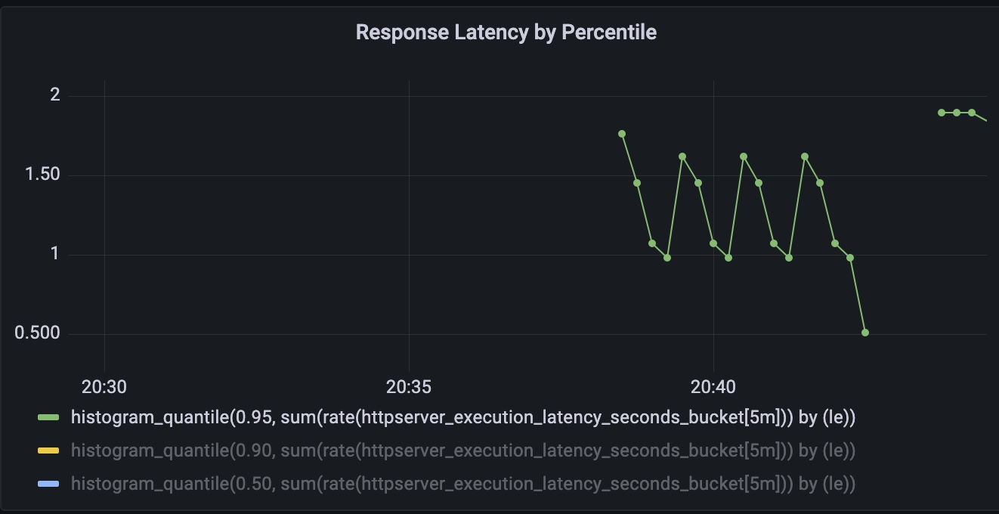

# 模块十作业
- 为 HTTPServer 添加 0-2 秒的随机延时
- 为 HTTPServer 项目添加延时 Metric
- 将 HTTPServer 部署至测试集群，并完成 Prometheus 配置
- 从 Promethus 界面中查询延时指标数据

（可选）创建一个 Grafana Dashboard 展现延时分配情况

作业提交链接： https://jinshuju.net/f/z0Z07s

提交截止时间：12 月 12 日 23:59

# 答题
### 1，2. 题见代码
### 3.见k8s.yaml
```
make deploy
```
请求httpserver服务

curl http://httpserver/hello
### 4.Promethus 查询 与 Grafana Dashboard
```
histogram_quantile(0.95, sum(rate(httpserver_execution_latency_seconds_bucket[5m])) by (le))
histogram_quantile(0.90, sum(rate(httpserver_execution_latency_seconds_bucket[5m])) by (le))
histogram_quantile(0.50, sum(rate(httpserver_execution_latency_seconds_bucket[5m])) by (le))
```
Grafana Dashboard


